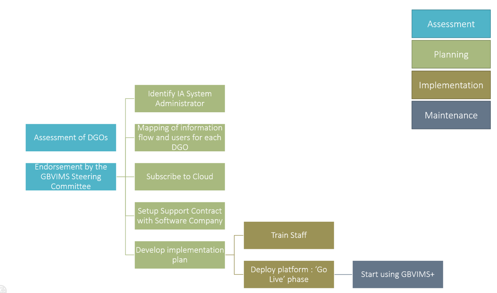

# GBVIMS+ Overview

### What is Primero and GBVIMS+?

Primero is the protection related information management system. It’s an application developed to enable humanitarian actors to safely and securely collect, store, manage and share data for protection-related incident monitoring and case management. The system was developed by UNICEF, IRC, Save the Children, UNFPA. This platform has individual modules for Gender-Based Violence and Child Protection. Each of these modules is built off inter-agency, field-tested legacy systems – the GBVIMS and CPIMS. For each of these systems, Primero is the ‘next-generation’ version. ​

Primero is made up of two modules. One for GBV, one for Child Protection. These modules can be deployed individually or together. We use the analogy of a house. GBVIMS+ is one room, CPIMS+ is another room. Because they’re all built on the same platform it’s possible for the systems to communicate, and users can also stay in the module they need and not use the others.

In this documentation, we’ll focus on GBVIMS+ - the module that hosts incident monitoring and case management information for survivors of gender-based violence.

The GBVIMS+ in simple terms is a database. It’s one module of Primero that holds information about GBV survivors and the care they receive. It’s an enhancement on the current incident recorder of the GBVIMS because it has an added function for case management.

Our goal in developing Primero/GBVIMS+ was to create a survivor-centered system that utilizes technology enhancements to manage individual cases and services for survivors as well as aggregate incident monitoring.​

Having case management tracking in the system in addition to incident monitoring is the most noticeable feature of the system for GBV service providers.  There are several other to note as well:​

* Primero/GBVIMS+ is flexible and adaptable – it can accommodate different program structures and can be customized for each setting.​
* It allows for quick updates to the system and bug fixes​
* It can accommodate different languages​
* If data is hosted on the cloud, it can eliminate the need to compile data internally in your organization​
* One of the most beneficially features is role-based  access.  This means case work staff can see only their cases, and a supervisor only the cases of their direct reports, and a coordinator only aggregate information.  This best responds to the principle of ‘need to know.’​
* And it features heightened security. This was a crucial part of the development of this system.  Primero is built in a secure framework and before it was even field-tested had threat tests conducted.

Data can be entered via a web application and via a mobile application. 

* On the web, data is entered on a laptop using a web browser. The web application has the highest functionality with access to features such as referrals and flags. The web application cannot be used without the internet.
* On the mobile, data is entered on a mobile device. It can be used with and without internet/data connection. It is used solely for data entry \(not referrals or flagging\). To utilize the mobile application, IT resources are required for setup and administration.

### If you’ve been using the traditional GBVIMS and are interested in using GBVIMS+ - what does that mean for your work?​

What will stay the same?​

The good news is a lot! If you’re already using the GBVIMS, you already have a leg up.  The core tools of the system remain – for the most part.​The intake and consent form, classification tool, and ISP will remain unchanged.​ However, the flow of data and use of the incident recorder will change, but even that tool will remain in use.  The primary change will be in data entry.  Instead of entering information from the intake form into the incident recorder, information will be entered into GBVIMS+.  ​

The information entered by casework staff into GBVIMS+ will eventually be exported into the incident recorder for analysis and inter-agency data sharing.   It may be that in the future, other third party analysis tools can be used for analysis and reporting or that that functionality will be strengthened in the GBVIMS, but currently, exporting to the incident recorder allows the least disruption in our analysis and inter-agency data sharing practices.​

### ​What do I need to rollout GBVIMS+​ at the Inter-Agency Level?

1. **Cloud-hosting of the GBVIMS+ platform:** This will ensure that the platform is available for use by the DGOs​
2. **Budget** to maintain the Cloud and Support Contract with Software Company: This requires funding in order to maintain the platform and data that are stored. The budget will be discussed further in the presentation.​
3. **SoP** for Case Management based on the IA CM Guidelines \(2017\) ​
4. **GBV or GBVIMS Coordination** body to support the rollout of GBVIMS+

### What do I need to rollout GBVIMS+​ within my organization?

Within your organization you will need to ensure that you meet the following criteria or requirements:​

1. Organization providing **services** to GBV survivors: the platform is more relevant for staff providing CM services but can also be used by PSS/health actors. However, it is a requirement that specialized services are provided directly to survivors.​
2. **Hardware** \(computers and mobile devices\): mobile devices only if internet connection or context requires.​
3. Staff familiar with **web-based navigation**: Otherwise, it will be challenging for them to use Primero that is accessed through a web browser. ​
4. Access to **internet** connection: At least from time to time to be able to sync mobile device to web application​
5. **Human Resources**: caseworkers, supervisor and IT person \(not dedicated\) is preferable, especially if mobile is used \(in order to manage mobile device: upgrade, etc.\)​
6. Organizational **commitment** to implement GBVIMS+: it is important that Senior management within your organization signs off on the rollout of a new IMS such as GBVIMS+.

### What is the process of rolling out GBVIMS+?

Similarly to the GBVIMS rollout, GBVIMS+ rollout is divided into 4 phases: Assessment; Planning; Implementation and Maintenance.​

* **Phase 1: Assessment Phase.** In this phase, DGOs will have to demonstrate that they have the required resources to rollout GBVIMS+. The assessment tool is looking as DGOs’ capacity both in terms of IMS and GBV Case Management. The assessment will also determine key technical and logistical aspects linked to the context from CM practices to connectivity issues. Once the assessment is completed, the Global GBVIMS Steering Committee will decide whether the rollout of GBVIMS+ in this specific country is endorsed. The endorsement by the GBVIMS SC means that technical resources will be dedicated to support the rollout. ​
* **Phase 2:  Planning.** This phase includes \(a\) identifying a System Administrator who will be the Inter-Agency Focal person for the maintenance of the GBVIMS+ platform in-country. In addition, during this phase, DGOs will need to map information flow and users. This will inform the creation of users for each DGOs according to their role as well as consideration linked to the use of mobile phone if connectivity is an issue.  During this phase, the lead agenda coordinating the rollout will setup a contract with a Software company in order to provide technical support to the platform and will subscribe to the Cloud for data storage. Finally, actors using GBVIMS+ will jointly develop and agree on an Implementation Plan that will be the blueprint of the rollout of GBVIMS+ in this specific country.​
* **Phase 3: As part of the implementation phase**, staff should be trained on the GBVIMS+ by a certified trainer, usually this process would be done directly by the Global-level Technical Team during an in-country mission. In parallel, the platform will be deployed, this is what we call the ‘Live phase’. ​
* **Phase 4: The maintenance phase** is the longest phase. This is when organizations will start collecting, compiling and analyzing data. Consultation will start in order to develop or revise an Information Sharing Protocol if needed.  During these phase, ongoing training and coaching of staff should take place in order to maintain there skills to use the GBVIMS+​

The overall rollout of GBVIMS+ can take between 2 to 6 or more months depending on whether resources are there for the rollout to happen.

### What support is available for GBVIMS+?

The benefits of GBVIMS+ is that it is supported by a range of actors, depending on the gravity of the issue faced. This is done in order to ensure that critical GBV data entered in the system are maintained and users can receive continuous technical support for the use of the platform. Whenever users are experiencing bugs in the system, the process will begin with Level 1 support, and will “escalate” up to Level 2 and 3 only when the issue/request cannot be addressed by Level 1 support providers.​

* Level 1: These are issues such as a user support problem that can be resolved either by training, guidance, or by making a small change in the configuration. Examples are: Password lost or reset request; User Error issues; Any “How to” and “Why can’t I” questions which cannot be resolved using existing documentation or training materials. Level 1 support is provided first by the Organization Focal Point of IA System Admin in country. If they cannot solve it, they would refer to the GBVIMS Global Team.​
* Level 2: This is a serious issue that requires a major configuration change, or IT support to resolve. Usually it involves restarting the application on the server, or repairing corrupted data. This level of helpdesk is usually provided by a Third Party, a software company. The software company will always be contacted by the GBVIMS Global Team.​
* Level 3: This is a critical problem which is affecting work and requires an immediate code change \(a “hotfix”\) or an immediate upgrade to an operating system component. This can be caused by a hidden bug that suddenly started to manifest or likelier by a recently publicised security concern about an underlying security component. This level of support is also provided by a Software Company through the GBVIMS Global Team. ​

 As an example for the System Admin, if the issue/request cannot be addressed by Level 2 support, it will be escalated to Level 3.  Level 2 and level 3 support will be provided by Quoin, however, they have different implications in terms of time and budget needed. Level 2 fixes could be rebooting the server when level 3 fixes could be code fixing or hacking attempts. 

### Why do we need a third-party to use GBVIMS+?

At several phases of the rollout of GBVIMS+, we will need to refer to a Third Party, namely a Software company who will be able to provide this type of service. In rare cases, organizations will have, to some extent, internal resources that could provide such support. However, it is most likely that, at the inter-agency level, the lead organization coordinating the rollout of GBVIMS+ will have a Support contract with one of the pre-approved software company to provide such support. ​

This support includes:​

1. **Implementation support:** This service type aims at deploying the platform on the Cloud. It’s the « Go Live » phase​
2. **Production Support and Maintenance \(PSM\):** These are ongoing costs – usually billed monthly, associated with keeping the platform functioning securely and responding to the needs of users. For example, if we request support for Level 2 and 3 of the helpdesk, the service type provided by the Software company will be related to PSM. ​
3. **Software development:** These are optional costs. It includes adding more requirements to build new features to the platform. One example could be to include KPI for Case Management in the platform. 

